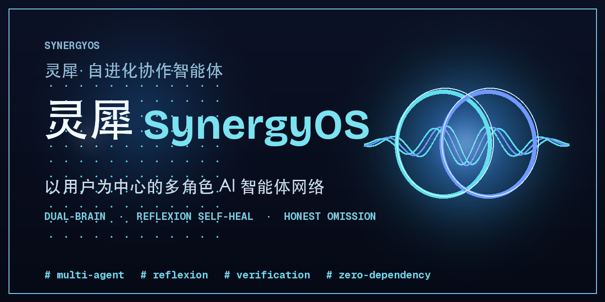

# 灵犀 · 自进化协作智能体（SynergyOS）

> 心有灵犀一点通 —— 以用户为中心的多角色 AI 智能体网络。
> 从「被动应答」走向「主动共生」：懂得在正确的时间做正确的事，在适当的时候保持沉默。



[](https://github.com/ShadowQuill/synergyos/actions/workflows/ci.yml)
[](https://github.com/ShadowQuill/synergyos/actions/workflows/pages.yml)
[](https://shadowquill.github.io/synergyos/)
[](https://www.python.org)

📑 文档导航：[Menu](./menu.md)

## 核心理念
灵犀不只是一个模型，而是一个 **Multi-Agent 网络**，通过「分工-协作-反思」模拟人类顶级团队：
- **左脑（执行者）**：逻辑推理、代码生成、数据分析 —— 专注「如何把事做对」。
- **右脑（观察者）**：基于历史交互构建动态偏好库 —— 专注「如何让用户满意」。

## 四大核心机制
| 机制 | 模块 | 说明 |
|---|---|---|
| 双脑协作 + 多智能体 | `agents/`（Architect/Programmer/Tester/Observer/Arbitrator 五个独立 Agent 类）+ `core/brain.py`（编排门面） | 左脑 architect→programmer→tester 执行；右脑观察评分；仲裁融合；程序员可经工具接口调外部工具 |
| 冷启动偏好锚定 | `core/profile.py` | 3-5 题最小探测建画像 + 后台静默学习 |
| 自适应生长与修复 | `core/reflexion.py` + `core/verify.py` | Reflexion 回溯协作链；**真实模型下 `verify.py` 真跑 pytest 并自动修复代码**（反思自愈） |
| 智能节律控制 | `core/pause.py` | Pause Horizon 预测停时 + 优雅暂停 + 阶段简报 |
| 软学习闭环（越用越聪明） | `core/learning.py` | 经验库 + 失败模式库 + few-shot 注入 + 反思权重跨会话持久化（零依赖、可离线；**非梯度学习**，详见诚实说明） |
| 量化评测基准 | `eval/`（cases + runner） | 跨场景评测集，量化「必备要素完整率 / 满意度 / 经验召回率」，让自进化收益可被数字度量 |

## 运行方式
```bash
# 1) 开箱即跑（Mock 离线引擎，无需任何 API Key）
python3 -m synergyos.cli --auto --task "写一个函数计算斐波那契数列第 n 项"

# 2) 交互式冷启动（终端问 5 道选择题建立画像）
python3 -m synergyos.cli

# 3) 接入真实大模型（零改代码，检测到环境变量即切换）
export OPENAI_API_KEY=sk-...
export OPENAI_MODEL=gpt-4o-mini        # 可选
python3 -m synergyos.cli --task "你的任务"

# 4) 导出运行报告（Markdown + HTML，含画像/双脑/反思/节律/时间线）
python3 -m synergyos.cli --auto --task "写一个去重函数" --report
#   仅 HTML：--report-format html   仅 MD：--report-format markdown
#   指定目录：--report-out my_reports

# 5) 安装为命令行工具（pip install 后即可使用 `synergyos` 命令）
pip install -e .
synergyos --auto --task "你的任务"

# 6) 按应用场景真跑（同一套双脑内核，按领域自适应产出）
#    paas=个人助理周报 / biz=商业分析可视化 / dev=软件研发需求到用例
python3 -m synergyos.cli --auto --scenario biz
#    不指定 --task 时，会用各场景的默认任务提示；也可显式给任务：
python3 -m synergyos.cli --scenario dev --task "实现去重并保持顺序的函数"

# 7) 软件研发助手：把架构/代码/用例真落盘为文件（原型要有交付物）
python3 -m synergyos.cli --scenario dev --task "实现去重并保持顺序的函数" --emit ./out
#    生成 ./out/<任务>/plan.json + solution.py + tests.py + README.txt
#    填了 OPENAI_API_KEY 后，此处落盘的就是真实可运行代码（代码零改动）
#    --emit 会自动识别测试 import 的模块名并复制同名副本（如 expiring_lru_cache.py），
#    保证 `cd ./out/<任务> && pytest tests.py` 开箱即跑，无需手动重命名。
#
# 8) 真实验证 + 反思自愈（仅真实模型，按场景分流）：
#    · dev：把生成的 solution+tests 写入临时目录真跑 pytest；失败则两阶段反思修复
#      ——先尝试修正实现，若仍失败说明断言自身与契约矛盾，则强制只修正那条测试断言
#      （如已过期的 key 被断言返回原值 → 改为 is None），最多重试 3 次。
#    · paas / biz：无 pytest 可跑，改用结构化验收——校验交付物是否覆盖场景必备要素
#      （周报须含 本周完成/进行中/风险/下周重点；分析须含 图表/趋势建模/数据），
#      缺失则用模型修复器补全，最多重试 3 次。
#    · 用户显式排除优先级：用户说「不要/不用 X」或「只列/只要 X Y」时，被排除的要素
#      不再强制补全，验收仅诚实标注「⏭ 已按用户要求省略」；且不被「未包含X」等
#      文字游戏干扰。规则：限定包含（只列A B = 包含A、B，排除其余）> 强排除（不要X）
#      > 模板必备要素。
#    （无人工干预的软修复）。CLI 与运行报告都会如实标注「✅ 通过 / ❌ 需人工复核」，
#    而非盲信模型的空壳 verdict。
python3 -m synergyos.cli --scenario dev --task "实现支持过期时间的 LRU 缓存" --emit ./out --report

# 9) 接入真实国产大模型（DeepSeek / 通义 / 智谱），零改代码：
export DEEPSEEK_API_KEY=sk-...          # 或 DASHSCOPE_API_KEY / ZHIPU_API_KEY
python3 -m synergyos.cli --auto --scenario dev --task "实现去重并保持顺序的函数"
#   显式选引擎：--provider deepseek|qwen|glm|openai；都不传则按已配 Key 自动选（优先 deepseek）

# 10) 让程序员真读写文件 + 真实联网搜索（默认离线模拟）：
python3 -m synergyos.cli --auto --scenario dev --task "读取 requirements.txt 并给出优化建议" \
    --workspace ./sandbox --online
#    文件读写限定在 --workspace 沙箱内（默认 workspace/），禁止越界与删除，安全可控

# 11) 开启「软学习闭环」——经验跨会话积累，越用越聪明：
python3 -m synergyos.cli --auto --scenario dev --learning-dir ./.synergyos_learn \
    --task "实现一个快速排序"
#    第二次类似任务会检索到首轮经验并作为 few-shot 回灌；权重与经验落盘持久化

# 12) 跑量化评测基准（离线确定性，零 token）：
python3 -m synergyos.eval           # 默认强制 Mock（即便本机配了真实 Key），秒级、可 CI 复跑
python3 -m synergyos.eval --real    # 想用真实模型跑对比时才加 --real（消耗 token）
#    输出必备要素完整率 / 满意度 / 经验召回率，附逐用例明细
```

> 全链路默认仍走 **Mock 离线引擎**（零 token、零依赖）。以上 9–12 任意一项命中真实能力时，才需要对应环境变量 / 标志。

## 应用场景（CLI 真跑）
同一套双脑协作内核（`architect → programmer → tester` + 观察者 + 反思），通过 `--scenario` 参数按领域自适应生成贴合的产出，并真正走完整链路：

| 场景 | 默认任务 | 左脑产出 | 验收方式 |
|---|---|---|---|
| `paas` 个人助理·周报 | 整理本周工作并生成结构化周报 | 周报（完成/进行中/风险/下周重点） | 结构化 |
| `biz` 商业分析·可视化 | 分析上半年销售额并生成可视化图表 | 数据清洗+建模脚本（科技蓝数据风） | 结构化 |
| `dev` 软件研发·需求到用例 | 实现去重并保持顺序的函数 | 代码 + 测试用例 | pytest 实测 |
| `code-review` 软件研发·代码评审 | 审查这段去重函数并指出问题与改进 | 代码评审报告（问题/严重性/建议/结论） | 结构化 |
| `data-analysis` 商业分析·数据洞察 | 分析上半年销售额并给出关键结论 | 数据分析报告（数据/趋势/结论，图表可选） | 结构化 |

> `dev`（软件研发助手）是产品的**楔子场景**：需求 → 架构师拆解 → 程序员编码 → 测试员用例，全程接真模型。专用提示词已强化（架构师输出接口契约/边界、程序员输出可运行模块、测试员输出 pytest），配合 `--emit` 落盘为真实可运行的交付物。其余场景作为"也能做"的延伸。

- 场景化产出由 `core/scenarios.py` 定义，引擎在 `scenario` 参数下按场景路由；接入真实大模型时该 mock 不再生效，改由提示词驱动。
- 产出会进入运行报告（`--report`），报告头显示「应用场景」字段。

## 两种记忆：偏好记忆 vs 语义记忆（设计说明）

灵犀刻意把「记忆」拆成两类截然不同的东西，避免把"记住用户"和"记住知识"混为一谈：

| 维度 | 偏好记忆（`core/profile.py`） | 语义记忆（`core/memory.py`） |
|---|---|---|
| 记的是什么 | **关于"人"**：用户的沟通风格、详细度、审美、风险偏好 | **关于"事"**：领域知识、历史交付、设计原则等共享知识 |
| 数据结构 | `UserProfile`（结构化字段 + 置信度） | `SemanticMemory`（文档库 + TF-IDF 倒排索引） |
| 怎么更新 | 冷启动 5 问锚定 + 每轮右脑偏好命中/未命中回灌（指数滑动平均） | `add()` 入库，`retrieve()` 按相关性召回 |
| 怎么用 | 注入提示词，让产出贴合"这个用户" | 任务来临时检索相关片段，回填给架构师做规划上下文 |
| 本质 | 个性化（Personalization） | 长期知识库（Retrieval / RAG 雏形） |

语义记忆层目前用**纯标准库的 TF-IDF + 余弦相似度**实现（中文额外做字 bigram 分词提升召回），零依赖、可离线；它是"检索增强（RAG）"的最小可用雏形——接入 embedding 后可直接升级为向量检索。详见 `examples/99-tools/`。

> 三者边界：① **偏好记忆**（关于"人"）② **语义记忆**（关于"知识"，RAG 雏形）③ **软学习经验库**（`core/learning.py`，关于"任务成败经验"，驱动失败模式库与 few-shot）。前两者是"注入什么上下文"，后者是"从成败里沉淀可复用经验"——互补不重叠。

## 智能体调工具（MCP 风格工具接口，零依赖）

改进报告 P0：智能体不能只会聊文本，要能调外部工具 / API。灵犀在 `agents/tools/` 实现了与 MCP「工具调用」语义等价的**进程内抽象**，不引入 `mcp` SDK、保持零第三方依赖：

- 每个工具自描述：`Tool(name, description, parameters, fn)`；
- 智能体在回复里嵌入统一协议 `<tool_call>{"name": "...", "arguments": {...}}</tool_call>`；
- `ToolExecutor` 解析并回调工具函数，把结果回填给智能体继续推理；
- 内置工具：`read_file` / `write_file` / `list_dir`（**真实副作用**，默认限定在 `--workspace` 沙箱内、禁删、越界拒绝）；`web_search`（**默认离线模拟**，置 `--online` 或环境变量 `SYNERGYOS_ONLINE=1` 时走标准库 `urllib` 真搜）。

`ProgrammerAgent` 支持 `act_with_tools(...)`：先尝试用工具取上下文（读文件 / 搜资料），再把结果回填后产出代码。接入真实 MCP 时，只需把 `fn` 换成 mcp 客户端的 `tool/invoke`，**协议层不变**——这正是"智能体通信底座"的雏形。离线演示见 `examples/99-tools/`。

## 量化评测基准（eval 集）

改进报告 P1#5：让"自进化收益"可被数字度量，而非空泛宣称。灵犀内置跨场景评测集与运行器（`eval/`）：

- `eval/cases.py`：覆盖 `dev / paas / biz / code-review / data-analysis` 共 7 条评测用例，每条给出任务、场景与必备要素。
- `eval/runner.py`：确定性运行并产出指标——
  - **必备要素完整率**：结构化验收（paas/biz）或关键子串（dev）覆盖比例；
  - **满意度均值**：右脑观察者评分；
  - **经验召回率**：开启软学习后，第二轮有多少用例检索到了相似历史经验（直接量化记忆层 / 失败模式库的覆盖）。
- **默认强制 Mock 引擎**，与本机是否配了真实 Key 无关——基准必须确定性、零 token、可 CI 复跑；要跑真实模型对比，显式加 `--real`（或传入 `engine=`）。

运行：
```bash
python3 -m synergyos.eval                 # 离线确定性评测（开启软学习经验积累），秒级完成
python3 -m synergyos.eval --no-learning   # 仅首轮基线，不统计经验召回率
python3 -m synergyos.eval --real          # 真实模型评测（消耗 token，用于自进化收益对比）
```

## 「自进化」vs「真学习」——诚实说明（面试必问）

灵犀宣传的**「自进化 / 越用越聪明」是经验式软学习，不是梯度学习 / 微调**，这一点必须讲清楚，避免被追问时露怯（这是本项目的刻意取舍，也是面试里的大加分项）：

- **它做了什么（已实现）**：
  1. **反思软修复**：反思器（Reflexion）给每次交付判 `pass / logic_error / preference_error`，按错误来源**动态调整各智能体权重（±0.1，封顶 [0.3, 2.0]）**，无人工干预地弱化"偏错"角色、强化"对"的角色；并把右脑偏好信号回灌用户画像（偏好记忆的静默学习）。
  2. **软学习闭环**（`core/learning.py`，对应报告 P1#4）：每次任务记一条经验（成败 / 失败类型 / 用过的工具 / 反馈），失败经历聚合成**失败模式库**，新任务检索相似历史作为 **few-shot 注入**回灌给智能体；反思权重与经验库**跨会话持久化**，重启后仍在 → 真正"用一次聪明一点"。
- **它没做什么（务必诚实）**：**没有反向传播、没有更新模型权重、没有从零学会新能力**。权重调整是启发式、经验回灌是检索式，二者都**不改模型参数**；它提升的是"在相同/相似任务上的表现稳定性与经验复用"，而非"模型本身的通用能力"。
- **所以该怎么讲**："自进化"指的是**系统在无人工干预下，通过反思闭环完成软修复、并跨会话累积经验与偏好**——是"会自我校正与记忆、会用历史经验"，不是"会自我训练"。接入真实大模型后，经验回灌会直接改善生成质量（量化评测中经验召回率即度量其覆盖）。

> 完整评测数据见 `eval/`；真实 DeepSeek 验收记录见 [EVIDENCE.md](./EVIDENCE.md)。

## 用户显式排除要素优先级
当用户在任务里**显式排除**某些要素时，灵犀尊重用户意图而非机械套用模板：
- 用户说「**不要 / 不用 X**」（强排除）或「**只列 / 只要 X Y**」（限定包含）时，被排除的要素**不再强制补全**。
- 验收报告诚实标注「⏭ 已按用户要求省略」，而非假装已覆盖。
- 优先级三态：`限定包含（只列 A B = 包含 A、B，排除其余）` > `强排除（不要 X）` > `模板必备要素`。
- 规则用**作用域判定**（强排除信号之后到下一个标点之间才生效），避免跨组污染；覆盖判定升级为**行级否定感知边界匹配**，根除「未包含风险」等文字游戏误判。
- 真实 DeepSeek 验证记录见 [EVIDENCE_EXCLUDE.md](./EVIDENCE_EXCLUDE.md)。

## 偏好持久化（一次提问，终身受用）
用户画像默认落盘到 `~/.synergyos/profile.json`，跨会话静默学习累积：
- 首次运行自动锚定并保存；之后再启动直接加载历史画像，跳过冷启动探测。
- `--no-persist`：关闭持久化，仅本次运行有效（用于演示 / 测试）。
- `--profile-path PATH`：自定义画像文件路径（如团队共享同一画像）。

## 模型接入策略（多国产引擎，零改代码）

灵犀对接**任意 OpenAI 兼容接口**，且内置四套国产 / 国际预设。调用方代码零改动：

| 引擎 | 环境变量 | 默认模型 | 端点 |
|---|---|---|---|
| DeepSeek | `DEEPSEEK_API_KEY` | `deepseek-chat` | `https://api.deepseek.com` |
| 通义千问 | `DASHSCOPE_API_KEY` | `qwen-plus` | 阿里云百炼兼容端点 |
| 智谱 GLM | `ZHIPU_API_KEY` | `glm-4-plus` | 智谱开放平台 |
| OpenAI | `OPENAI_API_KEY` | `gpt-4o-mini` | `https://api.openai.com/v1` |

- **端点 / 模型可覆盖**：`SYNERGYOS_BASE_URL`、`SYNERGYOS_MODEL` 对任意 provider 生效（可指向自建 / 本地推理服务）；provider 为 `openai` 时也尊重 `OPENAI_BASE_URL` / `OPENAI_MODEL`——把国产模型直接配在 `OPENAI_*` 变量里（OpenAI 兼容生态的通行做法）同样可用，不会误打 `api.openai.com`。
- 默认 `MockEngine`：规则生成演示内容，全链路离线可跑，**零第三方依赖**。
- `build_engine()` 自动择优选型：① `SYNERGYOS_FORCE_MOCK` 强制 Mock；② 显式 `--provider` 或 `SYNERGYOS_PROVIDER`；③ 已配 Key 的第一个可用引擎（优先 deepseek）；④ 都没有则 Mock。
- 任意缺 Key 的真实引擎会自动优雅降级到 Mock，保证链路仍可演示。
- 推荐用项目根 `.env` 存放密钥（已纳入 `.gitignore`，**不入库、不进命令行历史**）。
- 使用真实模型需安装 SDK：`pip install openai`（或 `pip install synergyos[openai]`）。未安装时运行会给出清晰提示。
- 密钥安全：本仓库**绝不**把任何 API Key 写入代码或提交历史；Key 仅来自你的环境变量 / `.env`。若 Key 曾在聊天或截图中暴露，请立即到对应平台**轮换（revoke）**。

验证真实引擎已接入：
```bash
DEEPSEEK_API_KEY=sk-xxx python3 -c "from synergyos.core.engine import ENGINE; print(ENGINE.is_real(), ENGINE.cfg.provider, ENGINE.cfg.base_url)"
# 应输出 True deepseek https://api.deepseek.com

# 用 OpenAI 兼容变量接国产模型也可以（端点会被正确尊重）：
# OPENAI_API_KEY=sk-xxx  OPENAI_BASE_URL=https://api.deepseek.com/v1  OPENAI_MODEL=deepseek-chat
```

## 可视化演示
浏览器打开 `synergyos/demo/index.html`，可交互体验：双脑协作动画、冷启动问答、软修复调权、节律控制、实时协作时间线，以及「应用场景」区块（个人助理周报 / 商业分析可视化 / 软件研发需求到用例三选一，含专属产出与时间线回放）与运行报告导出。
Logo 源文件见 `synergyos/demo/logo.svg`（莫比乌斯环 + 声波波纹）。

## 在线演示与部署
- **在线演示（GitHub Pages）**：<https://shadowquill.github.io/synergyos/> —— 由 `.github/workflows/pages.yml` 自动把 `synergyos/demo` 部署，push 到 `main` 即更新。
- **CI（持续集成）**：`.github/workflows/ci.yml` 在 push / PR 时自动运行 93 项单测（`SYNERGYOS_FORCE_MOCK=1`，零 token 消耗）。
- **本地提交闸门**：仓库内置 `pre-commit` 钩子，提交前自动跑单测，任一失败即阻断提交，保证上库代码始终绿。
- 启用 Pages：仓库 `Settings → Pages → Build and deployment → Source` 选择 **GitHub Actions** 即可（首次部署需手动开启这一步）。

## 结构
```
synergyos/
├── agents/            多智能体（每个角色一个独立 Agent 类，名副其实的 Multi-Agent 网络）
│   ├── base.py        Agent 基类（统一引擎/总线接入）
│   ├── artifacts.py   共享数据结构（LeftArtifacts / Observation）
│   ├── prompts.py     场景化提示词工厂
│   ├── architect.py   左脑·架构师（支持语义记忆 / 经验 few-shot 注入）
│   ├── programmer.py  左脑·程序员（支持工具调用 act_with_tools）
│   ├── tester.py      左脑·测试员
│   ├── observer.py    右脑·观察者
│   ├── arbitrator.py  仲裁器
│   └── tools/         MCP 风格工具接口（零依赖）：base.py（Tool/Registry/Executor）+ builtins.py（文件读写沙箱 / 联网搜索）
├── core/
│   ├── engine.py      模型引擎（Mock / 真实 OpenAI 兼容，内置 deepseek/qwen/glm/openai 预设，自动择优选型）
│   ├── bus.py         事件总线（协作过程可观测）
│   ├── profile.py     冷启动偏好锚定 + 静默学习 + 磁盘持久化（偏好记忆）
│   ├── memory.py      语义记忆层（TF-IDF 检索，与偏好记忆区分的长期知识库）
│   ├── learning.py    软学习闭环（经验库 + 失败模式库 + few-shot + 权重跨会话持久化）
│   ├── brain.py       双脑协作编排门面（组合 agents/ 下的 Agent 类）
│   ├── reflexion.py   自适应生长与修复（权重可调，可持久化）
│   ├── pause.py       智能节律控制
│   ├── scenarios.py   应用场景（paas/biz/dev/code-review/data-analysis）元数据与场景化 mock 产出
│   ├── orchestrator.py 分工-协作-反思 顶层编排（接入引擎/工具/记忆/软学习）
│   ├── report.py      运行报告生成（Markdown / HTML）
│   └── verify.py      真实验证 + 反思自愈（dev: pytest 实跑+两阶段修复；其余场景: 结构化验收+补全；支持「用户排除要素优先级」与否定感知边界匹配）
├── eval/              量化评测基准（cases.py 评测集 + runner.py 运行器，离线确定性）
├── cli.py             终端演示入口（支持 --provider/--workspace/--online/--learning-dir 等）
└── demo/              index.html + logo.svg
```

## 运行报告导出
- CLI：`--report` 把一次运行导出为 `reports/*.md` 与 `reports/*.html`（画像 / 双脑 / 反思 / 节律 / 时间线全链路可观测）。
- 网页：演示页新增「⑤ 运行报告导出」区块，可一键预览（HTML 新标签页）或下载（Markdown），与 CLI 报告同构。

## 测试
零依赖（仅标准库 `unittest`）：
```bash
python3 -m unittest discover -s tests -v
```
覆盖引擎路由、事件总线、冷启动锚定、双脑协作、反思调权、节律控制、编排全链路、报告生成、偏好持久化、应用场景、独立 Agent 类、MCP 风格工具接口（含沙箱越界拒绝 / 离线搜索桩）、语义记忆层检索、软学习闭环（经验库 / 失败模式库 / 权重持久化）、量化评测运行器，以及 `verify.py` 的「失败→反思修复→通过」自恢复（dev 两阶段修复 + paas/biz/code-review/data-analysis 结构化验收 + **用户显式排除要素的优先级规则** + **否定感知的边界匹配**），**共 93 项**。

> 测试全程强制 Mock 引擎（`SYNERGYOS_FORCE_MOCK=1`），即使项目根 `.env` 含真实 Key 也不会误打真实 API。接入真实模型时该开关不生效。
